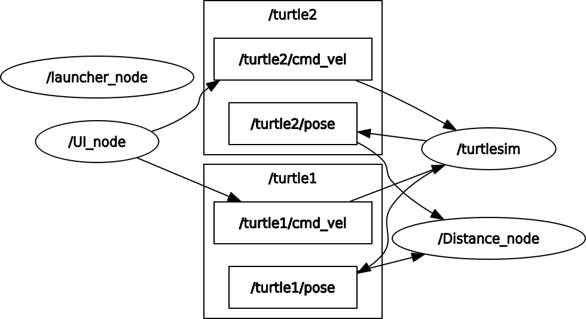

# **Turtlesim research track assignment**

This project provides a system for managing and controlling turtles in the ROS `turtlesim` simulator. The project is composed of two nodes: the **UI Node** and the **Distance Node**. These nodes facilitate spawning, killing, and moving turtles while ensuring they don't collide or move out of bounds.

---

## **Overview**

### **Staring point with two turtles** 

### **You can choose to add as many turtles or remove any from the UI**

---

---

---
### **Nodes**
1. **UI Node**
   - Allows users to interact with turtles through a terminal-based menu.
   - Users can:
     - Spawn new turtles.
     - Move turtles with specified velocities for a given duration.
     - Kill turtles.

2. **Distance Node**
   - Monitors turtles' positions to:
     - Prevent collisions by stopping turtles if they are too close.
     - Stop turtles that move outside the simulator's boundaries.

---

## **Features**

### **UI Node**
- **Turtle Management:**
  - Spawn **as many** new turtles by specifying name, position (`x`, `y`), and orientation (`theta`).
  - Kill turtles by selecting their corresponding number.
  
- **Movement Control:**
  - Move turtles with user-defined linear (`Vx`) and angular velocities (`Theta_dot`) for a specified duration.
  - Stops movement if:
    - The turtle reaches a boundary which is identified by a parameter set by the distance node.
    - The **Distance Node** halts the turtle to avoid collisions.
    
    
- **Interactive Menu:**
  - Simple menu for controlling turtles.
  - Dynamic handling of a vector of turtle objects.

---

### **Distance Node**
- **Collision Avoidance:**
  - Computes distances between all turtles.
  - Sets a parameter responsible for to Stop turtles if the distance between any two turtles is less than a defined threshold (default: 1.0 unit).
- **Boundary Enforcement:**
  - Sets a parameter responsible for stopping turtles if they move out of the simulator boundaries (`x` or `y` outside 1 to 10).
- **Dynamic Turtle Management:**
  - Adds and removes turtles dynamically based on updates to the `turtle_names` parameter.

---

## **Installation and running**
- **Dependencies:**
  - ROS Noetic
  - `turtlesim` package

- **Additional ROS Packages:**
  - `geometry_msgs`
  - `turtlesim`
  
1. `cd <catkin_worksapce_path/src>`
2. `git clone https://github.com/Melasmar-711/Research-Track-assignment_1.git`
3. `cd ..`
4. `catkin_make`
5. `roslaunch assignment1_rt Assignment1_rt.launch`

